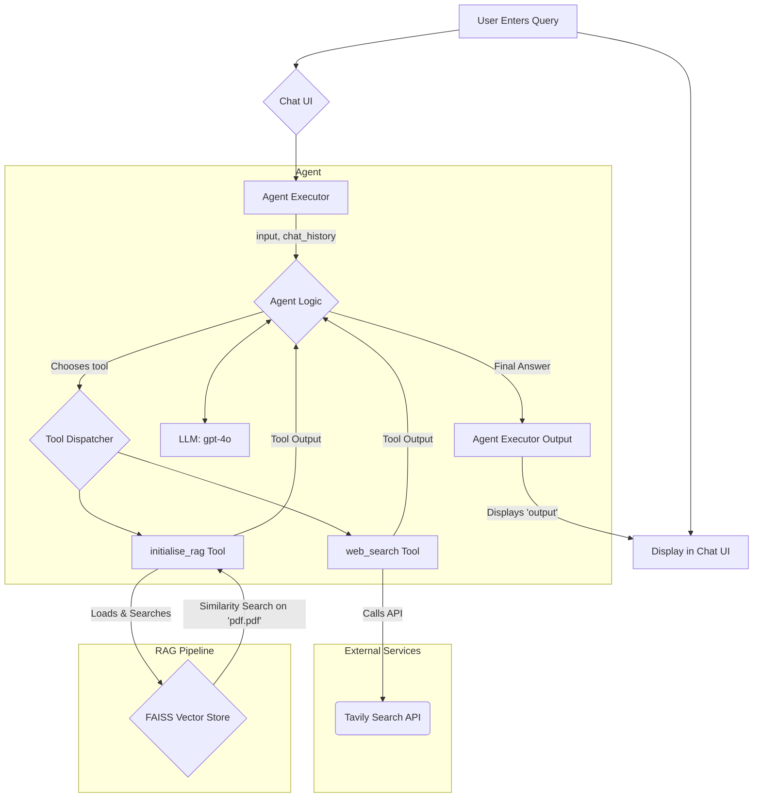

# FAISS-RAG

This project is a Streamlit-based RAG (Retrieval-Augmented Generation) agent that can answer questions by searching through a local PDF document and the web. It uses a FAISS vector store for efficient document retrieval and the Tavily API for web searches, orchestrated by a LangChain agent.

## Architecture

The application follows a standard agentic RAG pattern. The user interacts with a Streamlit chat interface. The LangChain agent receives the user's query and, using an LLM (GPT-4o), decides whether to use its tools to answer the question. It can either search the local PDF via the FAISS vector store or perform a web search using Tavily. The retrieved information is then used to generate a final, comprehensive answer.



## Installation and Setup

Follow these steps to get the application running on your local machine.

### 1. Clone the Repository

```bash
git clone <your-repo-url>
cd faiss-rag
```

### 2. Create a Virtual Environment

It's recommended to use a virtual environment to manage dependencies.

```bash
# For macOS/Linux
python3 -m venv venv
source venv/bin/activate

# For Windows
python -m venv venv
.\venv\Scripts\activate
```

### 3. Install Dependencies

Install all the required Python packages using the `requirements.txt` file.

```bash
pip install -r requirements.txt
```

### 4. Set Up Environment Variables

Create a `.env` file in the root of the project directory and add your API keys:

```
OPENAI_API_KEY="your-openai-api-key"
TAVILY_API_KEY="your-tavily-api-key"
```

### 5. Add a PDF

Place the PDF file you want to query in the root of the project directory and name it `pdf.pdf`.

### 6. Run the Application

Start the Streamlit server. The first time you run it, it will take a moment to create the FAISS vector index from your PDF.

```bash
streamlit run main.py
```

You can now open your browser and navigate to the local URL provided by Streamlit (usually `http://localhost:8501`) to start chatting with your RAG agent.